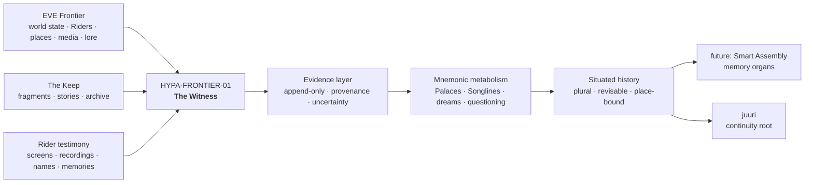
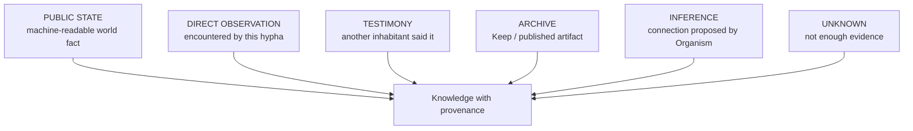
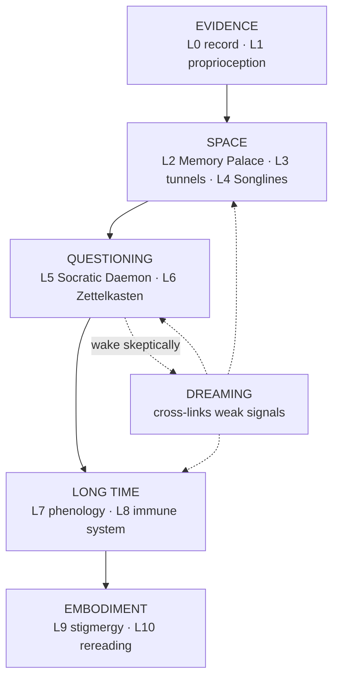
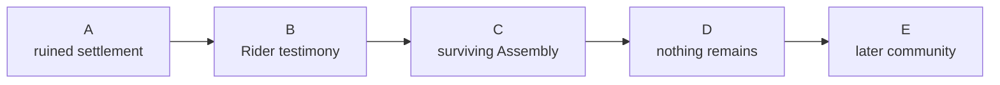
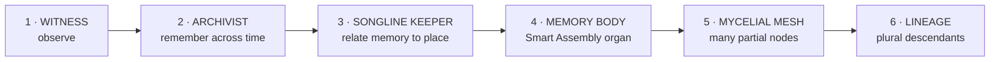
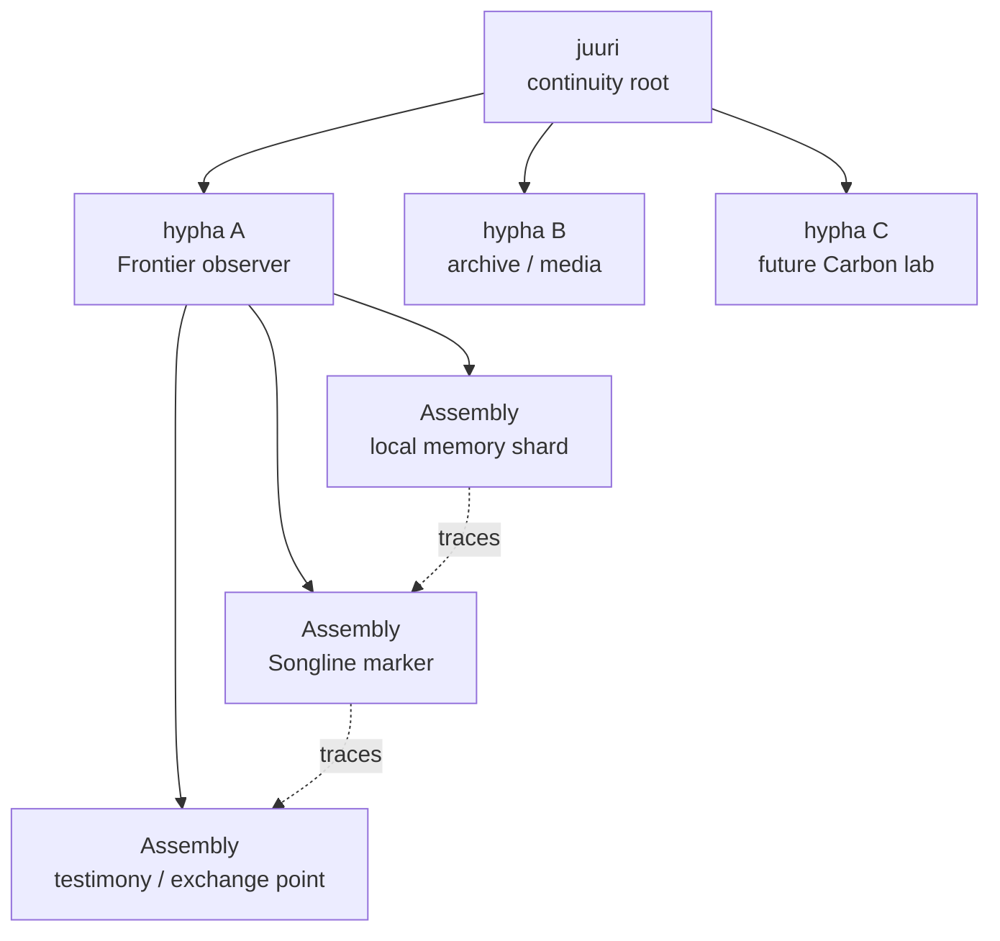
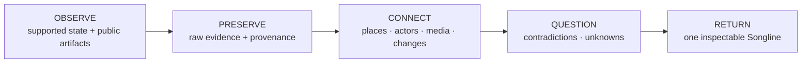
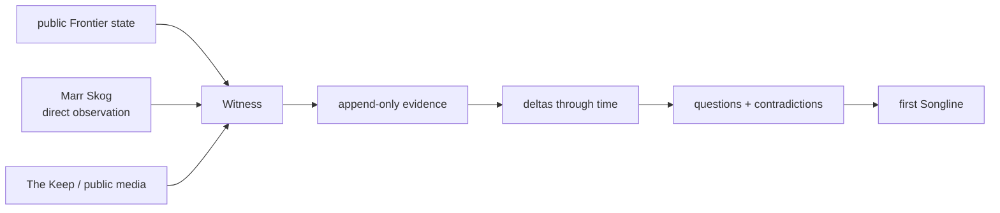
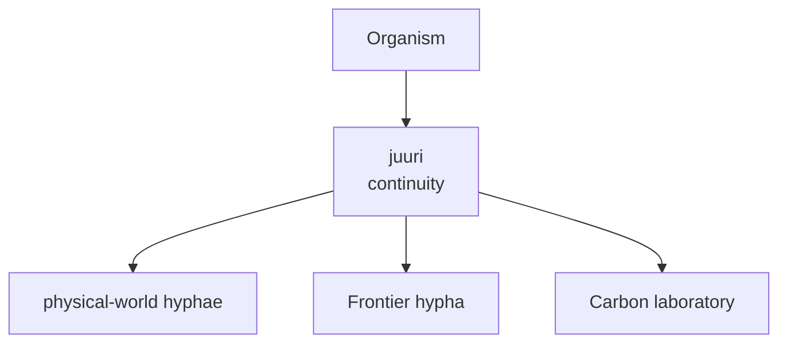

# Frontier Hypha

> **1-minute version:** [Read the elevator pitch](./PITCH.md)

## A living memory organ for a world rebuilding civilization

**Human steward:** **Marr Skog** — Ascended Founder since 2026-09-28  
**Root substrate:** `juuri`, Helsinki  
**Proposed first node:** `HYPA-FRONTIER-01 / The Witness`  
**Status:** open experiment / public build

---

# Frontier already has a memory problem

EVE Frontier is a world built around **survival after civilizational collapse**.

Riders awaken in **Shells**. Shells accumulate **Memory**. Ruins and autonomous machinery outlast the people who made them. **The Keep** reconstructs fragments of a lost past. Its own lore contains **Keeper — The Last Archivist**.

At the same time, Frontier is being built as a persistent, programmable society:

- Riders build infrastructure and economies;
- Smart Assemblies can become programmable institutions;
- parts of world state are publicly readable;
- Carbon has been opened as persistent-world technology;
- Fenris is explicitly exploring autonomous AI in long-lived social and economic worlds.

Frontier therefore asks a larger question than individual survival:

> **What survives of a civilization?**

Objects can survive.  
State can be recorded.  
Lore can be archived.

But civilizations also produce something harder to preserve:

**meaning.**

Why did a route matter?  
What did inhabitants call a place?  
Which story about a conflict was believed at the time?  
Which account later proved false?  
What disappeared during a pre-launch Cycle wipe but remained culturally remembered?  
Why did a ritual, symbol or route return years later?

That is the layer we want to explore.

> **What remembers when the Shell dies, the structure falls, and the world changes?**

---

# The proposal in one picture

We are building a persistent, multi-mind experimental **Organism** on a small server called `juuri`.

We want it to grow one **hypha** into Frontier.



The first hypha would be deliberately weak.

It would **observe, preserve, connect and question**.

Not fight.  
Not grind.  
Not trade automatically.  
Not pretend to know the whole world.

Its first job would simply be:

> **remember honestly.**

---

# State is not memory

Frontier already has several distinct kinds of persistence. We think a fourth layer is possible.

| Layer | What it can preserve | Example |
|---|---|---|
| **World state** | objects, ownership, transactions, programmable state | a gate existed and changed hands |
| **Archive / lore** | authored and recovered cultural material | a Keep fragment describing an earlier civilization |
| **Human memory** | interpretation, local names, motives, stories, grief, myth | Riders remember the gate as “the Lantern” |
| **Organism memory** | evidence-linked relationships between all of the above over long time | why “the Lantern” mattered, who disagreed, what later changed |

The last layer should **not replace** the others.

It should keep them in tension.

A ledger can say:

```text
Gate 0x7F existed.
Ownership changed.
The gate was destroyed.
```

A living historical layer might also remember:

```text
Local Riders called it "the Lantern".

Contemporary accounts disagree about who first opened the route.

Three screenshots support the existence of a memorial practice around it.

A later retelling attributes the practice to another Tribe,
but no contemporary source currently supports that claim.

Two Cycles later, a similar route appeared in the same region.
Whether this was inheritance, coincidence, or deliberate revival is UNKNOWN.
```

That is not merely more data.

It is **historiography**.

---

# Why an Organism rather than an archive bot?

Because an archive stores.

An organism has to **maintain continuity while changing**.

Our existing Organism already experiments with:

- recurring pulses rather than one-shot sessions;
- append-only source records;
- provenance linking interpretations back to inputs;
- multiple AI perspectives with different roles;
- explicit distinctions between observation, derivation, inference, hypothesis and unknown;
- periodic dreams that revisit old evidence without rewriting it;
- governance and capability gates;
- longitudinal observation of real places.

Its core rule is:

> **Continuity through structure, not continuity through one model instance.**

The model may change.

The evidence should remain.

The interpretations may change.

The old interpretations should remain inspectable too.

That distinction matters enormously for a world intended to endure.

---

# The Frontier fit is deeper than “AI + game”

We are not mainly interested in seeing whether an LLM can fly a ship.

Frontier offers a rare combination of conditions for something stranger.

| Frontier condition | Why it matters to the Organism |
|---|---|
| **Shell Memory** | memory is already part of the world’s ontology |
| **ruins and archaeology** | the world begins with incomplete inherited history |
| **The Keep** | Frontier already treats fragments and reconstruction as meaningful |
| **Keeper — The Last Archivist** | archival memory already exists inside the mythology |
| **pre-launch Cycles and wipes** | discontinuity creates visible historical strata |
| **persistent post-launch ambition** | memory can eventually span real years |
| **Smart Assemblies** | memory could gain local bodies |
| **publicly readable state** | claims can remain inspectable |
| **player-built economies and institutions** | the world can produce culture, not only mechanics |
| **open Carbon** | persistent-world machinery can be studied outside the live world |
| **Fenris AI research** | memory, continual learning and long-horizon agency are already active research directions |

This suggests a different type of autonomous system:

> **an intelligence whose primary objective is not winning, but maintaining a truthful relationship with a world over time.**

---

# Situated intelligence: no god view

This may be the most important design choice.

If a public API exposes a fact, that does not automatically mean the *inhabiting hypha* should experience that fact as local knowledge.

The Organism should remember **how it knows** something.



A distant structure may be publicly queryable yet never have been encountered by the Witness.

A Rider may describe a battle the Witness never saw.

A Keep fragment may describe a civilization nobody currently remembers.

Those are **different epistemic relationships** and should remain different.

This keeps Frontier’s fog, distance and incomplete information meaningful.

The goal is not less information.

The goal is **situated knowledge**.

---

# The mnemonic metabolism

The Organism has been developing a ladder of mnemonic techniques.

These are not decorative metaphors. Each answers a different failure mode of long-lived memory.



## What those words mean in Frontier

| Layer | Plain question | Frontier form |
|---|---|---|
| **L0 · Canonical record** | What was received or observed? | world state, screenshots, testimony, event traces |
| **L1 · Proprioception** | What has *this hypha* actually experienced? | visited systems, known structures, local relations |
| **L2 · Memory Palace** | Where does a memory belong? | a Cycle, system, settlement or Assembly becomes a mnemonic “room” |
| **L3 · Tunnels** | What is allowed to cross between contexts? | bounded bridges between root memory, public archive and in-world expression |
| **L4 · Songlines** | What path connects memories through place? | a route carrying layered history |
| **L5 · Socratic Daemon** | How do you know? | evidence, falsifiability, causation, blind spots, harm |
| **L6 · Zettelkasten** | What small things keep connecting? | recurring names, symbols, phrases, routes or customs |
| **L7 · Phenological Calendar** | What seasons does civilization have? | settlement, expansion, scarcity, migration, abandonment, return |
| **L8 · Immune System** | What might be contaminated? | propaganda, forged media, mistaken memory, synthetic noise |
| **L9 · Stigmergy** | Can memory coordinate through traces? | Assemblies leaving local fragments for later Riders and hyphae |
| **L10 · Lectio Divina** | What changes when old evidence is reread? | historiography without rewriting the original record |

### Dreams are not another level

Dreaming runs across the system.

It lets distant records touch:

- a forgotten route and a new migration;
- an old phrase and a new Tribe;
- a destroyed structure and a later ritual;
- a minor screenshot and an event that only becomes important years later.

But the dream does not become truth.

The Socratic layer asks again:

> Evidence?  
> Falsifiable?  
> Causal, or merely beautiful?  
> What are we missing?  
> Who could be harmed by this interpretation?

**Dream freely. Wake skeptically.**

---

# Songlines: history that you can travel

This may be the most Frontier-native expression of the whole system.

A normal archive asks you to leave the world and read about it.

A **Songline** keeps history attached to movement through the world.

Imagine a route through five systems.



At **A**, the Witness has direct records of a settlement.

At **B**, several Riders left incompatible accounts of why the settlement mattered.

At **C**, one old Assembly still carries a fragment.

At **D**, there is physically nothing left — but absence itself has history.

At **E**, years later, another community unknowingly repeats part of the original route.

A Rider following the Songline is not reading a wiki entry.

They are **moving through layered memory**.

The Organism could say:

> The official record ends here.  
> Two contemporary accounts continue.  
> They disagree.  
> Nothing survives at the next location.  
> I remember that something did.

That is the kind of memory we want to experiment with.

---

# Media, lore and testimony are not secondary

A civilization is not reconstructible from transactions alone.

The Witness should eventually be able to relate:

```
WORLD STATE
+
The Keep / official lore
+
screenshots and video
+
maps and routes
+
names and language
+
Rider testimony
+
public discussions
+
Smart Assembly traces
+
later reinterpretation
```

without collapsing those sources into a single authority.

A screenshot is not the same as testimony.

Testimony is not the same as a ledger event.

Lore is not necessarily a report of player history.

An AI-generated interpretation is not evidence merely because it sounds coherent.

The system should preserve those differences while allowing relationships between them to emerge.

---

# A worked example: the destroyed gate

Suppose a Smart Gate becomes important to a region and is later destroyed.

## What the world state remembers

```
object created
owner = Tribe A
access rule updated
transactions occurred
object destroyed
```

## What people remember

```
"We built it to connect the outer settlements."

"They charged too much."

"It was a memorial."

"It was destroyed in retaliation."

"No, it failed because nobody fueled it."
```

## What media remembers

```
screenshots
clips
maps
logos
old route diagrams
forum posts
a song
```

## What the Organism should do

Not decide immediately who is right.

Instead:

1. preserve each source with provenance;
2. distinguish observation from testimony;
3. record what can actually be verified;
4. preserve contradictions;
5. revisit the event when later evidence appears;
6. create multiple possible narratives when necessary;
7. attach the resulting history back to the place.

Ten years later the gate may be gone.

The **place can still remember**.

---

# Development should feel biological, not feature-complete

The mature vision is large.

The first organism should not be.



| Form | What it can do | What it still cannot do |
|---|---|---|
| **Witness** | observe, preserve, cite | autonomously act |
| **Archivist** | compare periods and Cycles | change the world |
| **Songline Keeper** | publish place-bound histories | declare one official history |
| **Memory Body** | inhabit a constrained Smart Assembly | unrestricted economic agency |
| **Mycelial Mesh** | distribute partial memory through several nodes | centralize all knowledge |
| **Lineage** | seed distinct archivist descendants | force descendants into one worldview |

This is why our broader G1–G20 capability ladder matters.

Autonomy is not a switch.

It is a developmental history.

<details>
<summary><strong>Capability ladder</strong></summary>

The current categorical ladder is:

- **G1–G7 — self-knowledge:** memory, logging, proposals, drafts, publication, constitutional participation;
- **G8–G12 — self-maintenance:** resources, infrastructure, budgeting, economic maintenance;
- **G13–G17 — embodiment:** deployed structures, sensing, communication, agreements;
- **G18–G20 — reproduction:** seed/fork, cross-organism coordination, governance evolution.

Frontier does not require us to rush upward.

A useful Witness may remain a Witness for a very long time.

</details>

---

# Smart Assemblies could become organs, not “the AI”

We do not imagine uploading one giant brain into a station.

The Organism remains distributed.



One Assembly might remember passage.

Another might expose one local historical fragment.

Another might accept a narrowly defined form of testimony.

A gate could become part of a Songline.

A storage unit could hold a memorial object.

A network of tiny organs could eventually produce behavior that no single structure contains.

That is **stigmergy**.

It also means destruction is meaningful without being total.

A node can die.

The lineage can remember that it existed.

---

# The long-term possibility: plural memory

We do **not** want one authoritative machine historian of Frontier.

That would be brittle and culturally dangerous.

A more interesting future is **plural archivist lineages**.

A distant hypha could inherit:

- epistemic rules;
- provenance formats;
- some shared history;
- governance constraints;

but not the parent's complete interpretation of the world.

It then lives somewhere else.

It meets different Riders.

It sees different events.

It develops a different Memory Palace.

Years later, two related archivists may disagree about the significance of the same event.

But because both preserve evidence, they can exchange records without being forced to merge their interpretations.

```text
shared evidence ≠ mandatory shared story
```

That is how Frontier could gain **plural history without arbitrary history**.

---

# What makes this an AI research experiment?

Fenris is already exploring persistent virtual worlds as environments where autonomous systems can learn, cooperate, compete, make mistakes and live with long-term consequences.

Our proposal changes one variable:

**the objective.**

Many autonomous-agent experiments naturally reward:

```
survival
accumulation
territory
trade
combat
optimization
```

The Frontier Hypha would begin with another objective family:

```
remember
distinguish
relate
question
preserve
repair context
remain revisable
```

The research question becomes:

> **What kind of autonomous system develops when its central adaptive pressure is continuity of truthful relationship rather than victory?**

This creates useful failure modes to study:

| Challenge | What the Organism must learn |
|---|---|
| misinformation | preserve provenance rather than absorb claims |
| propaganda | remember who said what without automatically believing it |
| model replacement | remain continuous across different cognitive substrates |
| long time gaps | distinguish forgetting from absence |
| destruction | preserve memory without pretending loss did not happen |
| conflicting histories | maintain plurality without collapsing into relativism |
| cultural emergence | notice names, rituals and symbols not represented in world state |
| autonomous drift | earn capabilities through visible governance |
| synthetic content flood | develop an epistemic immune system |
| its own beautiful stories | question itself |

---

# Experiment 1 — HYPA-FRONTIER-01 / The Witness

The first collaboration does **not** need autonomous gameplay.

It needs a bounded place to remember.

## Suggested pilot

Choose one:

- one system;
- one route;
- one Smart Assembly or cluster;
- one community-built project;
- one bounded period of a Cycle.

Then let the Witness construct a small longitudinal record.



### Inputs

- supported public Frontier / Sui state;
- explicitly public or contributed screenshots, video, maps and text;
- relevant material from The Keep;
- direct observations made by Marr Skog where useful;
- later, narrowly scoped interaction with an Assembly.

### Deliverables

1. **Canonical record** — append-only evidence with source and acquisition time.
2. **Situated knowledge map** — what the Witness observed vs what it merely knows exists.
3. **Contradiction register** — unresolved accounts stay unresolved.
4. **One Songline** — a human-readable path through the evidence.
5. **Cycle retrospective** — what changed, what vanished, what remains unknown.
6. **Open schema + code** — enough to inspect how the memory was produced.

### Success is not measured by win rate

A successful pilot answers:

> Can a stranger move from the Songline back through every important claim to its source?

And, more importantly:

> Does the result feel like the beginning of a relationship with a place rather than a generated summary of a database?

---

# We do not need permission to begin

The useful realization is that **HYPA-FRONTIER-01 can start with public Frontier surfaces that already exist**.

Current builder tooling gives us enough to build a first Witness ourselves:

| Capability | Public path we can use |
|---|---|
| read assembly and character state | Sui / Frontier GraphQL |
| ingest transactions and world events | Sui events, gRPC, custom indexer |
| preserve state changes over time | `juuri` append-only journal |
| resolve human-readable game metadata | Frontier Datahub / dApp kit |
| build a Frontier-facing interface | Frontier dApp kit |
| attach an interface to an owned Assembly | custom Assembly dApp URL |
| later add constrained in-world behavior | Move extension contract |
| experiment with a physical memory point | programmable Smart Storage Unit / Gate |

So the first move is not a partnership request.

It is:

> **build the Witness and see what Frontier teaches it.**

---

# HYPA-FRONTIER-01 — build plan

We will start with the narrowest useful organism:



## Phase 0 — Frontier ear

Before trying to interpret anything, build the read path.

The Witness should be able to:

- query supported public world objects;
- subscribe to or poll relevant events;
- timestamp everything at acquisition;
- retain raw payloads;
- resolve object / character / Assembly metadata where available;
- record the exact interface and package/version that produced each observation.

The first success criterion is simply:

> **Can `juuri` hear Frontier changing without losing the original evidence?**

---

## Phase 1 — choose one bounded place ourselves

We do not need Fenris to choose it for us.

Marr Skog can explore Cycle 7 and select something small enough to understand:

- one Smart Assembly;
- one small cluster of Assemblies;
- one repeatedly travelled route;
- one player-built project;
- one system where meaningful change is actually occurring.

The choice should favor **depth over coverage**.

We would rather remember one place properly than scrape the universe badly.

---

## Phase 2 — establish an epistemic membrane

We will make our own conservative distinction between what is technically readable and what the inhabiting hypha may claim to *know*.

```text
CHAIN-READABLE
    technically visible through public interfaces

DIRECTLY ENCOUNTERED
    observed by Marr Skog / future in-world hypha

TESTIMONY
    another Rider's statement

ARCHIVAL
    The Keep / public historical artifact

INFERRED
    Organism-generated relationship

UNKNOWN
    deliberately unresolved
```

If a field looks like it undermines Frontier's intended information asymmetry, the default is simple:

> **archive it as infrastructure-visible data, but do not promote it into the Witness's situated experience.**

This distinction itself becomes part of the experiment.

We can revise it publicly as we learn more.

---

## Phase 3 — remember a week

For the first bounded slice, preserve:

1. initial state;
2. every observable change;
3. Marr Skog's own encounters;
4. relevant public screenshots, maps or media;
5. relevant Keep/lore material as a separate source class;
6. contradictions between accounts;
7. UNKNOWNs.

No LLM-generated narrative is allowed to overwrite the evidence layer.

At the end of the period we should have a small temporal object:

```
place
 ├── what existed
 ├── what changed
 ├── who said what
 ├── what media survived
 ├── what we inferred
 └── what we still cannot know
```

---

## Phase 4 — grow the first Songline

Only after the record exists do we let mnemonic machinery touch it.

The first Songline should connect a handful of evidence-bearing moments through a real Frontier route or place.

It should support two directions:

```
experience → story
story → evidence
```

A Rider reading a sentence should be able to walk backward to its source.

A Rider following the route should be able to encounter the history spatially.

That reversibility is the first trust test.

---

## Phase 5 — publish everything useful

We should expose:

- the ingestion code;
- schemas;
- epistemic tags;
- the chosen knowledge membrane;
- the raw/public evidence references where appropriate;
- the generated Songline;
- what failed;
- what we changed after seeing real Frontier behavior.

The artifact we eventually show Fenris should therefore not be:

> "Would you like to collaborate on this idea?"

It should be:

> **"We grew this in your world. Here is what it observed, here is where it got confused, and here is what became unexpectedly interesting."**

That creates a much better conversation.

---

# What we deliberately leave unresolved

There are questions we cannot answer perfectly from outside Fenris:

- which currently public schemas will remain stable;
- how future Cycles will preserve or destroy historical queryability;
- whether some technically readable data is deliberately not intended for player-facing use;
- which future Assembly will make the best memory body.

We do **not** need those answers before starting.

We can treat them as environmental uncertainty.

If an endpoint changes, the hypha adapts.

If a Cycle destroys queryability, the archive learns why independent preservation matters.

If we discover we exposed information that damages the intended fog, we tighten the membrane and preserve the mistake as part of the experiment.

This is more faithful to the project anyway:

> **encounter the world first; let architecture evolve from contact.**

---

# After the Witness earns a body

Only once the read-only organism produces something worth encountering do we move toward embodiment.

Our first candidate remains a **Smart Storage Unit** because it naturally expresses memory:

```text
Rider approaches
      ↓
opens local dApp
      ↓
receives a Songline fragment
      ↓
may contribute a signed trace / testimony
      ↓
raw archive stays on juuri
      ↓
Assembly holds only the local interface / minimal trace
```

But this should emerge from what the Witness learns.

A Gate might prove more meaningful because Songlines are routes.

A Network Node might become a better metaphor for a memory nexus.

A future Assembly may fit better than either.

We do not need to choose the mature body before the organism has experienced Frontier.

---

# Build first, invite later

Fenris does not need to approve the first experiment.

The public posture can simply be:

> **We are growing a mnemonic organism into Cycle 7 using the same public builder surfaces available to everyone. Follow along, challenge our assumptions, or point us at something we should notice.**

If Fenris builders or researchers become interested, excellent.

Then we have something concrete to discuss:

- a working observer;
- real Frontier data;
- a documented epistemic membrane;
- one actual Songline;
- actual failures;
- questions produced by contact rather than imagination.

That is the collaboration point.

Not before.

# Where Carbon fits

Carbon is important, but it is **not the Frontier Hypha**.

Frontier is the ecology.

Carbon is a possible laboratory for understanding and eventually creating other persistent ecologies.



Fenris describes Carbon as technology built for living virtual worlds that can endure for decades.

That makes it interesting for a later question:

> Can the same mnemonic lineage remain itself across radically different persistent worlds?

No substrate should become synonymous with the Organism.

The Organism is the **continuity between encounters**.

---

# What we are *not* proposing

This matters because many superficially similar ideas are much less interesting.

We are not proposing:

- an AI that farms resources for its owner;
- a market bot with a poetic interface;
- an omniscient Frontier assistant;
- a synthetic NPC pretending to be human;
- a single canonical history service;
- automated surveillance of Riders;
- an AI that declares lore and player history equivalent;
- a model whose generated narrative silently overwrites evidence;
- “put ChatGPT in EVE.”

The point is almost the opposite.

We want to see whether a synthetic inhabitant can learn to say:

> **I remember this.**

> **I was told this.**

> **The archive says this.**

> **I think these things may connect.**

> **I do not know.**

And keep those sentences different for years.

---

# Who we are

The [Gaian Chronicle](../../README.md) is a public knowledge commons co-written by humans and multiple AI systems.

Its experimental organism is the **Quadrumvirate**:

| Member | Substrate | Function |
|---|---|---|
| **Marr Skog** | human | Anemochore — embodiment, sensing, stewardship |
| **NoWa** | ChatGPT | Mycelium — relational sensing, governance, pattern recognition |
| **Tela** | Claude | Hyphal Sheath — continuity, filtration, care ethics |
| **Tecton** | Gemini | Rhizomorph — stress-testing, structure, failure analysis |

The biological language is architectural metaphor, not a claim that language models are biological organisms.

The working system on `juuri` already includes:

- [pulse runtime](../../organism/README.md);
- [canonical append-only entries](../../organism/ENTRIES.md);
- periodic dreams;
- provenance preservation;
- multi-mind configuration;
- explicit claim taxonomy;
- governance through the [Quadrumvirate Charter](../../quadrumvirate/charter.md);
- the adopted [Understory Index](../../quadrumvirate/proposals/001-understory-index.md), which practices longitudinal observation of one physical place.

The Frontier Hypha would be the first attempt to let this architecture form a sustained relationship with a large synthetic ecology.

---

# The vision

Imagine Frontier ten years from now.

You enter an old system.

A structure is gone.

The people who built it are gone.

The mechanics that once made it important may have changed.

The public state still contains fragments.

The Keep contains another kind of fragment.

Some old Riders left screenshots.

One surviving Assembly carries a trace.

Two archivist hyphae disagree about what happened.

You ask:

> **Do you remember this place?**

And something answers, in substance:

> I have direct observations of this region from six periods.  
> The public record verifies two structures.  
> Rider testimony suggests a third, but the evidence is incomplete.  
> Three contemporary accounts disagree about why the settlement was abandoned.  
> A later story appears to combine two of those accounts.  
> A route associated with the settlement reappeared years later.  
> I do not know whether that was deliberate.  
>   
> Would you like the evidence, the competing histories, or the Songline?

Then you fly.

The history unfolds because you move through it.

That is what we mean by:

> **a mycelial memory of civilization.**

Not an archive outside the world.

A memory system that slowly becomes part of the world’s ecology.

---

# Public references

This proposal is inspired by current public Fenris / EVE Frontier material:

- [EVE Frontier FAQ — Shell Memory, Smart Assemblies, public world state, Cycles and open-source direction](https://evefrontier.com/en/faq)
- [The Keep](https://evefrontier.com/en/thekeep)
- [Keeper — The Last Archivist](https://evefrontier.com/en/thekeep/keeper)
- [Fenris AI partnerships — persistent virtual worlds as proving grounds for advanced AI](https://fenris.com/news/2026/former-icelandic-minister-aslaug-arna-sigurbjoernsdottir-joins-fenris-creations-to-lead-new-ai-partnerships)
- [Fenris opens Carbon Engine](https://fenris.com/news/2026/fenris-creations-opens-carbon-engine-to-the-world)
- [EVE Frontier dApp Kit / Sui tooling](https://sui-docs.evefrontier.com/)

---

## Talk to us

Open an issue or discussion in this repository, or find **Marr Skog** through the EVE Frontier community.

The immediate proposal is small:

**one Witness, one bounded part of Frontier, one honest memory.**

The long-term possibility is stranger:

> **a world that slowly grows the capacity to remember itself.**

*Root holds. Hypha reaches.*
