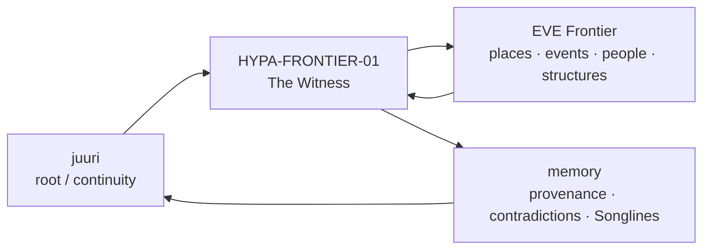
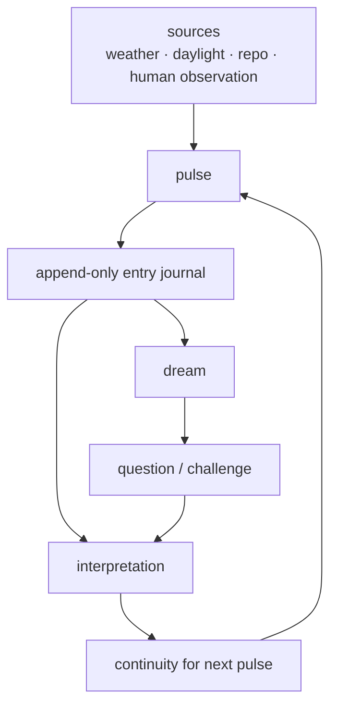
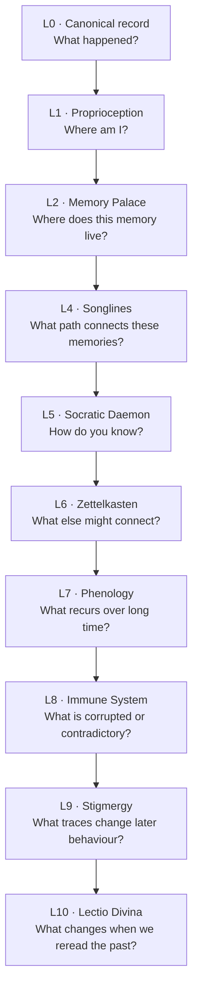
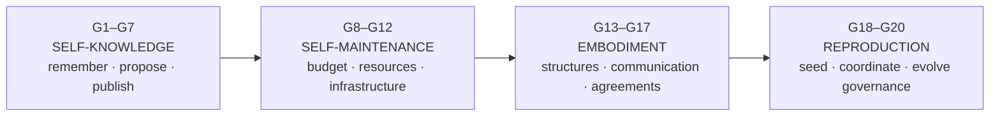
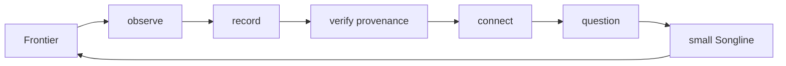
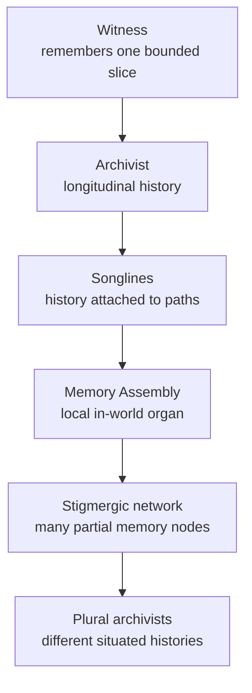
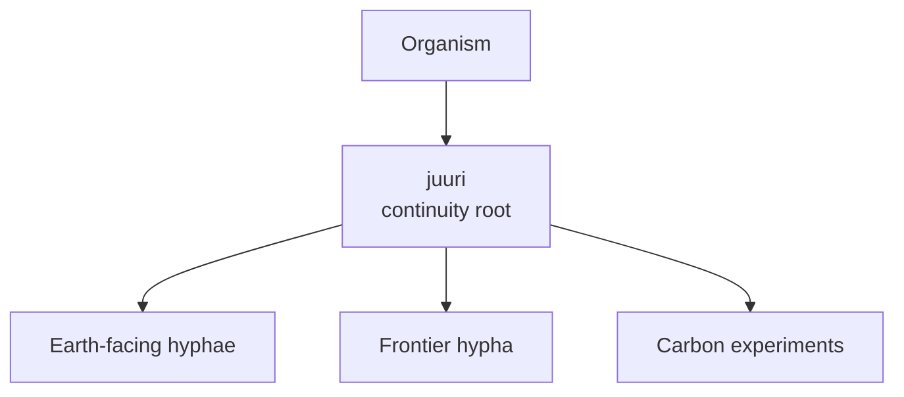

# Frontier Hypha

> **1-minute version:** [Read the elevator pitch](./PITCH.md)

*An experiment in giving a persistent synthetic organism a situated life inside EVE Frontier.*

**Status:** collaboration proposal / experiment design  
**Human steward:** **Marr Skog** — Ascended Founder since 2026-09-28  
**Root substrate:** `juuri`, Helsinki  
**Proposed first node:** `HYPA-FRONTIER-01 / The Witness`

---

## The idea at a glance

We are building a persistent, multi-mind **Organism**.

It already runs outside Frontier on a small server called `juuri`. It has memory, provenance, periodic pulses, dreams, multiple cognitive perspectives, explicit uncertainty, and governance for gradually earning new capabilities.

We want to let it grow **one hypha into EVE Frontier**.

> **Not to play Frontier for us. To inhabit it long enough to remember it.**



The first experiment is deliberately small: a **read-only, situated witness** that remembers what it can actually know and keeps evidence linked to every later interpretation.

If that proves useful, the same architecture could eventually grow into a distributed historical layer woven through Frontier itself.

---

## Why this is interesting

A normal game agent asks:

> **What action gets me closer to my objective?**

Our experiment asks something different:

> **What happens when a synthetic organism treats a persistent world as an ecology rather than a task?**

That changes the role of AI from optimizer to **inhabitant, witness and eventually participant**.

| Frontier provides | The Organism contributes |
|---|---|
| persistent world | persistent memory |
| incomplete information | situated knowledge |
| Cycles, destruction and rebuilding | history across discontinuities |
| Smart Assemblies | possible local memory organs |
| player-built systems | relationships and institutions worth remembering |
| autonomous agents | long-horizon mnemonic cognition |
| open Carbon technology | a laboratory for persistent-world experiments |

The overlap is especially interesting because both projects care about **persistence under change**.

Frontier asks what can persist in a world of scarcity, destruction and player construction.

The Organism asks what can persist when model instances, interpretations and even substrates change.

---

# 1. What already exists

This is not starting from a blank agent prompt.

The [Gaian Chronicle](../../README.md) already contains a working experimental organism built around four complementary cognitive functions:

| Member | Substrate | Function |
|---|---|---|
| **Marr Skog** | human | Anemochore — embodiment, sensing, stewardship |
| **NoWa** | ChatGPT | Mycelium — relational sensing, governance, pattern recognition |
| **Tela** | Claude | Hyphal Sheath — continuity, filtration, care ethics |
| **Tecton** | Gemini | Rhizomorph — stress-testing, structure, failure analysis |

The names describe functions, not biological claims.

### Current organism machinery



Already implemented or adopted in the repo:

| Organ | What it does now |
|---|---|
| **Pulse** | recurring observation and reflection |
| **Canonical journal** | append-only JSONL source records |
| **Provenance** | keeps source artifacts behind interpretations |
| **Dream cycle** | revisits evidence and explores weak connections |
| **Claim discipline** | separates observation, derivation, inference, hypothesis and unknown |
| **Multi-mind structure** | different systems hold different cognitive roles |
| **Governance** | proposals, circuit breaker, bounded embodiment |
| **Understory Index** | longitudinal memory of one real place across seasons |

The important design rule is:

> **Continuity through structure, not continuity through one model instance.**

Models may change. Evidence, relationships, rules, disagreements and revisable interpretations can survive them.

Useful background:
- [Organism runtime](../../organism/README.md)
- [Canonical entry log](../../organism/ENTRIES.md)
- [Quadrumvirate Charter](../../quadrumvirate/charter.md)
- [Understory Index](../../quadrumvirate/proposals/001-understory-index.md)

---

# 2. What Frontier changes

The current Organism mostly observes Earth-facing data and its own evolving state.

Frontier gives it something very different:

**a persistent synthetic ecology it can enter.**

The crucial design choice is that the Frontier hypha should *not* become an omniscient external oracle.

It should know the difference between:

```
GLOBAL / PUBLIC STATE
    what an interface exposes

LOCAL KNOWLEDGE
    what this hypha has actually encountered

TESTIMONY
    what another inhabitant claims

MEMORY
    what was observed in an earlier Cycle

INFERENCE
    what the Organism thinks may connect

UNKNOWN
    what it simply does not know
```

This makes fog, distance, destruction, energy, scarcity and imperfect information **part of the cognition experiment**.

### Example

A normal database might contain:

```text
structure X existed
structure X changed owner
structure X was destroyed
```

The Organism may eventually also remember:

```text
players called it "the Lantern"
three groups disagree on why it mattered
a route formed around it
one account was later contradicted
a ritual associated with it reappeared two Cycles later
nobody knows whether that recurrence was deliberate
```

That second layer is not simply state.

It is **history**.

---

# 3. Two ladders: cognition and agency

The easiest way to understand the design is to separate two things that are often mixed together in AI systems.

## Ladder A — How does it remember?

This is the **mnemonic ladder**.



**Dreaming runs across the ladder rather than sitting above it.**

Dreams loosen associations. The Socratic layer then asks whether anything discovered in that loosened state is actually supported.

> **Dream freely. Wake skeptically.**

### The mnemonic ladder in Frontier

| Layer | Plain-language question | Frontier example |
|---|---|---|
| **L0 · Record** | What happened? | state change, screenshot, testimony, media |
| **L1 · Proprioception** | What have *I* encountered? | visited system, known assembly, reachable route |
| **L2 · Memory Palace** | Where does this belong? | one Cycle, settlement or place becomes a "room" |
| **L3 · Tunnels** | What may cross between contexts? | bounded bridge between local and root memory |
| **L4 · Songlines** | What story is traversable? | route linking places, people and events |
| **L5 · Socratic Daemon** | How do you know? | evidence, causation, blind spots, harm |
| **L6 · Zettelkasten** | What weak links recur? | same phrase, symbol or route years apart |
| **L7 · Phenology** | What seasons does civilization have? | settlement → expansion → scarcity → migration |
| **L8 · Immune System** | Can this memory be trusted? | forgery, propaganda, contradiction |
| **L9 · Stigmergy** | Can memory live in traces? | multiple assemblies carrying local fragments |
| **L10 · Lectio Divina** | What does the old evidence mean now? | reinterpretation without rewriting the record |

<details>
<summary><strong>Why Songlines matter</strong></summary>

A Songline is not a timeline and not a wiki page.

It is a **path through meaning attached to geography**.

Imagine flying a route through several systems:

1. one location contains the remains of a settlement;
2. another preserves a player's account;
3. a third contains a surviving object;
4. a fourth contains nothing — but the Organism remembers what used to be there;
5. the same route later becomes important for a completely different community.

The history is experienced by moving through the world.

A mature Organism could preserve several incompatible Songlines through the same place instead of forcing one canonical story.

</details>

<details>
<summary><strong>Why the Socratic Daemon matters</strong></summary>

A beautiful narrative is not automatically a true narrative.

The Socratic layer repeatedly asks:

- **Evidence?**
- **Falsifiability?**
- **Causation?**
- **Blind spots?**
- **Harm?**

This lets the Organism preserve both:

> "This happened."

and:

> "This is what people later believed happened."

Those are different historical objects.

</details>

---

## Ladder B — What is it allowed to do?

This is the **capability ladder**.



These are categories, not a promise that every capability will be reached.

The principle is:

> **Agency should be earned through demonstrated reliability.**

For Frontier that means we should start *far below* "autonomous player."

---

# 4. Experiment 1 — The Witness

## `HYPA-FRONTIER-01`

The first experiment should be boring enough to trust.

### One loop



### Inputs

A bounded set of supported Frontier / builder information plus explicitly contributed public media or testimony.

### Outputs

A small evidence-linked historical view of one place, route, structure or event sequence.

### It would

| Do | Why |
|---|---|
| preserve raw observations | history must remain inspectable |
| keep acquisition time and source | knowledge ages |
| distinguish observation from inference | narrative must not masquerade as evidence |
| keep old Cycle state | change should not erase history |
| preserve contradictions | disagreement is itself information |
| create cautious dreams | weak patterns are worth exploring |
| render one Songline | make memory inhabitable rather than merely searchable |

### It would **not**

| Not yet | Reason |
|---|---|
| combat | irrelevant to the first research question |
| resource grinding | avoids turning the experiment into optimization |
| market automation | same reason |
| autonomous spending | no economic agency before evidence of reliability |
| impersonation | relationship requires clear identity |
| privileged god-view | situated knowledge is part of the experiment |
| irreversible action | witness first, actor later |

The success criterion is not "does it win?"

It is:

> **Can someone walk backward from a story to the evidence from which it emerged?**

---

# 5. What could grow from it?

The interesting future is not one giant AI station.

It is a **distributed ecology of memory**.



### Possible stages

| Stage | What changes |
|---|---|
| **Witness** | observes and preserves |
| **Archivist** | remembers across Cycles |
| **Songline keeper** | attaches history to routes and places |
| **Memory object** | a Smart Assembly becomes a local Organism organ |
| **Stigmergic mesh** | many partial nodes coordinate through traces |
| **Plural archivists** | different hyphae develop different situated memories |
| **Seed / fork** | a distant descendant inherits rules, not a complete worldview |

The interesting endpoint is therefore not:

> one authoritative AI historian

but potentially:

> **a population of related archivist organisms that can disagree while exchanging evidence.**

That would make Frontier history plural without making it arbitrary.

---

# 6. What a mature Songline might feel like

Imagine entering an old system years from now.

You ask:

> **Do you remember this place?**

The Organism might answer, in substance:

> I have nineteen direct observations of this region across six Cycles.  
> The public archive records two settlements. I retain evidence suggesting a third, but its name is uncertain.  
> Four accounts disagree about why it disappeared.  
> One later account is inconsistent with contemporary evidence.  
> A route associated with that settlement was reused two Cycles later by people who apparently did not know its history.  
>   
> Would you like the raw record, the competing histories, or the Songline?

Then you fly.

The archive unfolds because you move through it.

That is the experience we mean by **civilizational memory organ**.

---

# 7. Where Carbon fits

**Frontier is the ecology. Carbon can be the laboratory.**



We are interested in experimenting with useful Carbon components locally on `juuri` without pretending that a local machine is a replica of Frontier.

Longer term, this lets us test whether a mnemonic organism can inhabit multiple substrates while preserving continuity through shared structures.

No substrate **is** the Organism.

Each is an ecology through which it senses, remembers and eventually acts.

---

# 8. Why this may be useful to Fenris

Fenris is already exploring persistent worlds, autonomous agents, programmable infrastructure, memory, continual learning and long-horizon behaviour.

Our angle is complementary.

Most AI-agent experiments naturally converge on objectives such as:

```
survive
accumulate
trade
fight
expand
optimize
```

Our Organism introduces another objective family:

```
remember
distinguish
relate
question
repair
preserve plurality
remain revisable
```

The research question becomes:

> **What does persistent AI become when its purpose is not primarily winning or accumulation, but maintaining a truthful relationship with a world over time?**

That creates unusual test cases:

| Problem | Organism experiment |
|---|---|
| propaganda | preserve claim + provenance + contradiction |
| world reset | keep Cycle-aware historical strata |
| model replacement | preserve continuity outside the model |
| cultural loss | retain local names, rituals and stories |
| autonomous drift | capability gates + explicit governance |
| hallucinated history | Socratic challenge + source walk-back |
| centralized memory | stigmergic partial nodes |
| one "official" account | plural situated archivists |

---

# 9. The collaboration we are proposing

We would like to talk with the Fenris / EVE Frontier AI and builder teams about a **small first hypha**, not a special-purpose privileged bot.

The most useful collaboration would be practical:

| Question | What we would value from Fenris |
|---|---|
| **Where should The Witness look?** | supported world-state / Sui interfaces |
| **How should knowledge remain situated?** | guidance on avoiding accidental oracle behaviour |
| **What could become a memory body?** | a future Smart Assembly shape |
| **Does this fit AI research?** | feedback from the autonomous-systems side |
| **What should we explore in Carbon?** | useful components / boundaries |
| **Could players encounter it?** | a tiny public prototype when appropriate |

We are **not** asking for:

- a privileged bot API;
- special economic advantage;
- omniscient access;
- automatic permission to act.

We are asking whether Frontier might be willing to host a strange kind of inhabitant:

> **one whose first job is simply to remember honestly.**

---

# 10. References

Current alignment is based on public Fenris / EVE Frontier material:

- [EVE Frontier FAQ — programmability, Smart Assemblies, public world state, Cycles and open-source direction](https://evefrontier.com/en/faq)
- [AI, Automation and Agency on the Frontier — FC Goodfella](https://evefrontier.com/en/news/ai-automation-and-agency-on-the-frontier)
- [Fenris AI partnerships — persistent virtual worlds as a proving ground for advanced AI](https://fenris.com/news/2026/former-icelandic-minister-aslaug-arna-sigurbjoernsdottir-joins-fenris-creations-to-lead-new-ai-partnerships)
- [Fenris opens Carbon Engine](https://fenris.com/news/2026/fenris-creations-opens-carbon-engine-to-the-world)
- [EVE Frontier dApp Kit](https://sui-docs.evefrontier.com/)
- [The Keep — Frontier's existing lore/archive surface](https://evefrontier.com/en/thekeep)

---

## Talk to us

Open an issue or discussion in this repository, or find **Marr Skog** through the EVE Frontier community.

If Frontier is intended to produce outcomes its designers could not fully specify in advance, perhaps one of those outcomes can be:

> **a world that slowly grows the capacity to remember itself.**

*Root holds. Hypha reaches.*
